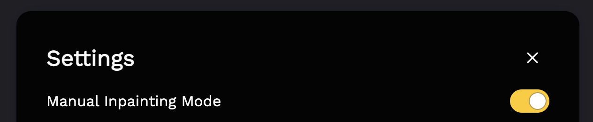

# Manual Inpainting Mode

By default, Lama Cleaner will run inpainting after drawing a stroke. You enable **Manual Inpainting Mode** in settings.

After you finish multi-stroke drawing, click the **Inpaint** button to run inpainting.

