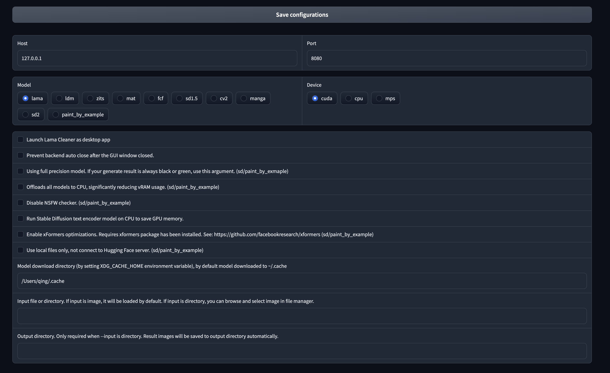

import { Callout } from "nextra-theme-docs"

## Windows 1-Click Installer

You can always install Lama Cleaner for free through pip or docker, or purchase this 1-click installer for:

- Convenient environment setup, include all plugins dependencies
- xformers included, use less vRAM and 40% speed up
- A web interface for server start configuration
- Easy to receive all future upgrades
- Show your support ❤️ for this project's future development

### Download Installer

Get the installer at [here](https://panicbyte.lemonsqueezy.com/checkout/buy/add85395-546d-481e-a8c4-777a0da999bb).

After a successful payment, you will receive an email containing a download link. 
If you never received the email, it might be due to an incorrect email address. Please open an issue [here](https://github.com/Sanster/lama-cleaner-docs/issues) with your email to contact me.

### Configure

Unzip the package, you will get a `win_config.bat` and a `win_start.bat` file.

Double click `win_config.bat`, it will take a few minutes to install all the dependencies(around 8G), and open the web config page in your browser.
You can config all command line args in the web page, such as the path to download the model, whether to save vRAM(CPU Offload), etc.
Click the `Save configurations` button will save an `installer_config.json` file in the same directory.

### Start Lama Cleaner

Double click `win_start.bat` to start the server, the first time it takes a few minutes to download the model.

### Check FAQ

If you encounter any problems, please check the [FAQ](../frequently_asked_questions) first to see if there is an answer

