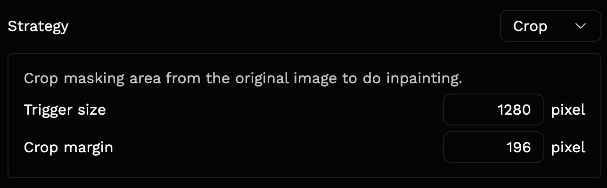

# Memory

If CUDA OOM happens to you, in addition to reducing the size of your images, following suggestions might be helpful:

## LaMa/LDM/ZITS/MAT/FcF/Manga

- Use `--device cpu`
- Change [Inpainting Strategy](https://lama-cleaner-docs.vercel.app/features/inpainting_strategy) to crop, and reduce the trigger size/crop margin
  

## Stable Diffusion

- Using [Croper](https://lama-cleaner-docs.vercel.app/features/croper)
- Add `--sd-disable-nsfw` and `--sd-cpu-textencoder` to the command line
- Add `--sd-disable-nsfw` and `--cpu-offload`(save more GPU memory but much slower) to the command line
- Install [xformers](https://github.com/facebookresearch/xformers) and add `--sd-enable-xformers` to the command line

## Paint By Example

- Using [Croper](https://lama-cleaner-docs.vercel.app/features/croper)
- Add `--cpu-offload`(save more GPU memory but much slower) to the command line
