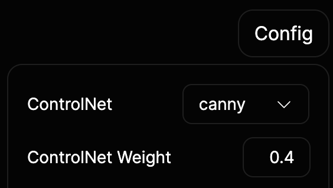

import { Callout } from "nextra-theme-docs"

# Stable Diffusion with ControlNet

You can enable ControlNet to get better inpainting result when using Stable Diffusion model.

```bash
--model sd1.5 --sd-controlnet --sd-controlnet-method control_v11p_sd15_inpaint
```

`--model` supported arguments:

- sd1.5
- anything4
- realisticVision1.4

`--sd-controlnet-method` supported arguments:

- control_v11p_sd15_canny
- control_v11p_sd15_openpose
- control_v11p_sd15_inpaint
- control_v11f1p_sd15_depth

Using local ckpt/safetensors model is also supported:

```bash
--model sd1.5 --sd-local-model-path /path/to/model-inpaint.ckpt --sd-controlnet --sd-controlnet-method control_v11p_sd15_canny
```

<Callout type="info" emoji="ℹ️">
  When using the `control_v11p_sd15_inpaint` method, it is necessary to use a
  regular SD model instead of an inpaint model.
</Callout>

It should be noted that the most suitable ControlNet weight varies for different methods and needs to be adjusted according to the effect. It is recommended to start with 0.4 for canny and openpose, and 1.0 for inpaint and depth.


