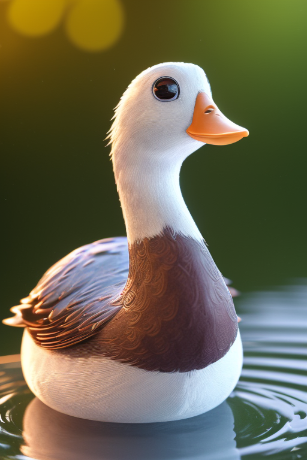
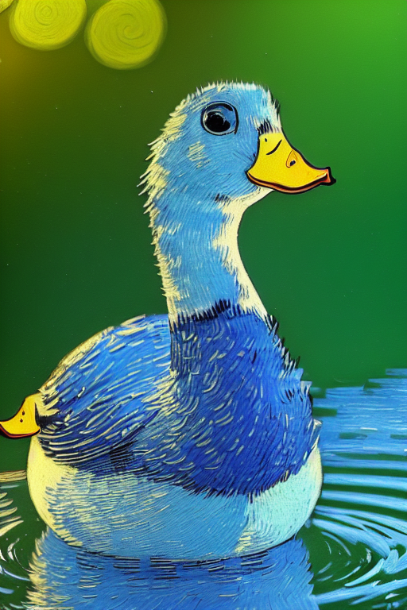

import { Callout } from "nextra-theme-docs"

# InstructPix2Pix: Learning to Follow Image Editing Instructions

<Callout type="info" emoji="ℹ️">
  This model is very large, please specify its name at startup so that the model
  can be fully downloaded on the first launch. This way, there will be no issues
  when switching on the website in the future.
</Callout>

- `--model instruct_pix2pix`
- github: https://github.com/timothybrooks/instruct-pix2pix
- paper: https://arxiv.org/abs/2211.09800

InstructPix2Pix model can work without mask.

| original                                         |                             result                             |                                       Prompt | Guidance Scale | Image Guidance Scale |      Seed |
| :----------------------------------------------- | :------------------------------------------------------------: | -------------------------------------------: | -------------: | -------------------: | --------: |
|  |  | turn the duck blue, in the style of van gogh |              9 |                  1.6 | 108227038 |
|  |  |                          make her hair black |              7 |                  1.5 | 749559112 |
|                  |                  |                               make it summer |              7 |                  1.5 | 195504576 |
